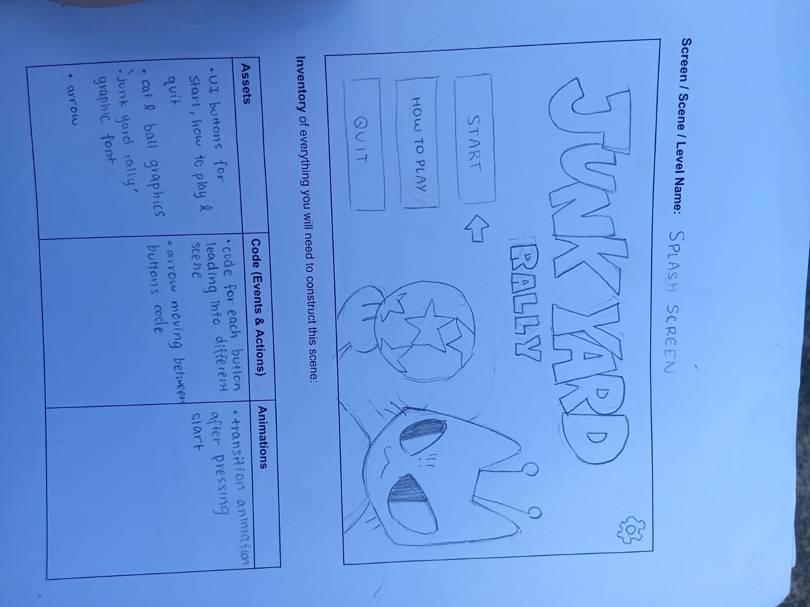

# 9CT Assessment Task 4 Portfolio - ARISA
## Identifying and Defining 
### Identifying a Need
**BRAINSTORM**
- Pretty world in 3D with 2D elements where you explore the city, talk to people and pick up trash to spread awareness about urban pollution while calming players
- Volleyball-esque game on UNITY that is low-stakes, charming and simple that can be played to help people improve hand-eye coordination, and timing while still having fun.
- Fishing in a whack-a-mole style to help increase reaction timing and general motor skills in a fast-paced and interactive game.
- Continuing with my 'Peach to Peach' game by also creating multiplayer and making interactable characters and enemies to make a world-based game for kobito zukan fans.
- Dating sim where you talk to bugs and pick your match that helps entertain users in their free time

---
### Need Statement
**Need** - To develop hand eye coordination and a quick reaction timing in young children and adolescents through a fast-paced but low stakes

**Problem Statement** - Not all young children and adolescents have the time or ability to play beneficial and fun games as they often require a large investment of time and commitment. A fast-paced volleyball-esque game that requires players to react to the ball and move with precision against an AI opponent can allow children to develop fine motor skills and hand eye coordination in a fun, low pressure environment that they can easily engage with or leave anytime. 

**Skill Development** - To develop the knowledge and skills needed to create this game on Unity, I would complete the following tutorial(https://youtu.be/vj7TiUKMgl0?si=mcNP4yfY7dV47pd1) as a base for my game and update its graphics later by either learning to use Blender or finding resources online that I can modify to fit my game's style. 

---
### Requirements Outline
**Inputs** - The game will require the ↑ ↓ → ← keyboard keys for player movement as well as the space bar for jumping. It will also require mouse clicks for UI elements like buttons and slider bars (in the settings).

**Processes** - My project should be able to process keyboard inputs and calculate the new player position, check for the ball's collisions with ground to reset the simulation and rally score. It should also be able to identify when the ball goes over the net (through the use of colliders) and calculate the rally score accordingly. The game should also process player clicks on UI elements and respond accordingly.

**Outputs** - The game will display the player's rally score, position in game and updates such as 'Game Over'. 

**Storage** - The game may store the player's high scores locally, which they will be able to view in the start menu. The game may also store player settings, such as music and fx volume.

**Transmission** - If I expand the game further, the game may transmit high score data and username on a database to create an online leaderboard.
---
### Functional Requirements
1. **User interaction**

The user will interact with the game through a combination of keyboard commands and mouse clicks. The user can perform player movement through the directional keyboard keys ↑ ↓ → ← and can jump using the space bar. 

2. **Scoring and Feedback**

When the system detects the ball going over the net (using a collider), the player will receive updates in the rally scoreboard. When the system detects the ball colliding with the ground, it will trigger the feedback response 'GAME OVER!'. (Also if I have time), when the rally score becomes higher than a previously stored high score, the feedback 'NEW HIGH SCORE!' will be displayed on the screen.

3. **Saving and Loading Data**

If I have time, the game will store high scores in the start menu and the game settings such as music and fx volume locally on the user's device. 

---
### Non-Functional
1. **Performance Requirements**

The game should load in around 2-4 seconds and should perform smoothly, responding to user inputs without a noticeable lag or any game glitches (eg. ball yeeting randomly). The character's movement shouldn't be choppy and should move according to the player inputs accurately.

2. **Usability Requirements**

The game should be extremely easy with an option for game instructions in the start menu for first time users. These instructions should outline game mechanics clearly, concisely and with personality, as well as example images on game play.

3. **Security Requirements**

The user data that will be in the game  like the high score and game settings will be encrypted and stored securely without any sensitive information.

4. **Scalability Requirements**

The game should be able to scale to include possible future different intensities and modes like competitive or collaborative local multiplayer without affecting the game's performance or creating noticeable lag.

---
### Social and Ethical Issues 
#### Equity and accessibility - What does it mean?

``` Equity is the quality of being just, fair and addressing existing inequalities and discrimination so everyone regardless of factors like gender, age and abilities is treated equally. Accessibility is the term for when something is easily usable for people, including those with disabilities or other factors. It's about removing limiting barriers so everything is ACCESSIBLE to everyone```
1. **Accessibility**

My project will be accessible to a wide range of abilities and should be adjustable to accommodate user needs. This means the game should include features like brightness, volume and text size adjustment and visual impairments will be considered when creating UI elements and choosing the colour palette for my game by implementing high visual contrast to make the game as readable and clear as possible. The game will also employ simple controls like the directional keys and space button to keep the game simple and easy to use for a variety of abilities.

2. **Privacy and Data Protection**

My game will most likely not be collecting user data due to the time constraints of this project but if I have time, the game will store high scores locally. If I implement the high score, I will ensure only essential information such as the score is stored and no sensitive data is stored. Additionally, the high score data should be stored securely in the game's local storage to protect it from unauthorised access or data leaks to ultimately ensure user privacy is respected.

3. **Fairness and Representation**

My project will be based on a futuristic junk-yard style with animal characters so there are minimal areas where social stereotypes could arise. Nonetheless, I will ensure that my characters are diverse and cannot be interpreted as harmful imagery toward any gender, race or culture. I’ll also aim to give each character a distinct style to ensure fair representation and balance within the game.

4. **Mental and Emotional Well-being**

My project will positively impact users’ mental health by exercising their mind with a highly interactive game while avoiding distressing content. Although volleyball is inherently a competitive sport, my game will focus on having a higher rally with your NPC friend and I would like to build a fun and relaxing atmosphere that enhances the wellbeing of players.

5. **Cultural Sensitivities**

My project has minimal representation of any cultures and specific symbols as the characters are non-human. However, while making this project I will avoid being inspired off specific countries and cultures that I am not familiar with and may misrepresent and will also ensure any symbols or themes I use are used with caution. While keeping this in mind, I hope to create a game that is both inclusive and culturally aware.


## Researching and Planning 
### Exploration of Existing Ideas

|Existing ideas | Plus | Minus | Implication  |
|---------------|------|-------|--------------|
| A Short Hike (beach stick ball) | A Short Hike has a cozy and warm game aesthetic that it pulls off really well. Combined with its simple point system and non-competitive nature (the NPC is rallying WITH you so you can both achieve 10 rallies), the beach stick ball game is really easy to play but still entertaining for players.  | The game is a little lenient in its rules, as when the ball touches the ground the player has a few seconds to hit the ball before the game is said to be over. | I overall really love A Short Hike's beach stick ball concept the best and for my game moving forward, I think I'll be referencing its warm, hazy(pixelated) aesthetic and would also like to make a less competitive game that focuses on long rallies rather than 'beating the opponent'. I also want to make sure that the player can't move after the ball touches the ground as soon as possible so there won't be any glitches or timespace for the player to hit the ball and continue the game like in A Short Hike. |
| Pon Pon Volley  | Pon Pon Volley has a cute game aesthetic and is very immersive in the storyline as it contains an introduction with sports commentators discussing the game with humorous remarks. It has a more competitive nature with the point system, which players may enjoy more, and has several modes that can be enjoyed including single player and multiplayer up to 4 players with different difficulty settings. I also quite like how its a 2D game but the space the player can move in looks 3D, which helps to create a sense of more freedom in the player movement. | Pon Pon Volley has a more complicated gameplay where it can touch the ground as long as its in the lined box area, however this was not outlined in the introduction to the game so it may be confusing for first time players. I'm also not sure about the colour palette as the green and brown clash a bit, but that's just a preference. | Pon Pon Volley in terms of layout is similar to A Short Hike (although its 2D) and I want to include its creative camera perspective in my game. I also really enjoyed the NPC conversations in the beginnning so that may also be a possible goal to enhance my game engagement, however, I want to stick to a more simple game that is almost self-explanatory(although I will include instructions), so it will not rouse confusion for first-time players/people like me. |
| Pong | Pong is a classic video game that although a bit different to my game proposal, contains all the basic features I want in my game. I like how simple and smooth the game play is, and its multiplayer settings make it more exciting and spontaneous. | Pong has very minimalistic graphics that although iconic, is not the look I'm going for in my game. As it is an old video game, it's lack of a complex AI opponent may make the game also feel boring, repetitive and too easy for many players. | The nature of Pong is very straightforward and throughout this project I want to be inspired off its layout and gameplay to help keep my game beginner-friendly as well, while also trying to avoid making the game as repetitive as Pong by having more visually appealing elements and more freedom to move your player around. I also believe that if my idea for this project was too far-fetched for my current skills, I will avert back to referencing Pong and just changing up the graphics a bit to create more personality. |

---
### Flowchart and Pseudocode

```
BEGIN Movement
	INPUT userInput
	IF '→' pressed THEN
		Move player right
	ELSE IF '←' pressed THEN
		Move player left
	ELSE IF '↑' pressed THEN
		Move player forward
	ELSE IF '↓' pressed THEN
		Move player backward
	ELSE IF ‘Spacebar’ pressed THEN
		IF player touching ground THEN
			Make player jump
		END IF
	END IF
END Movement 
```


```
BEGIN Scoring
	Score = 0
	INPUT netcolliderInput
	INPUT groundInput
	WHILE groundInput is 0 THEN
		IF netcolliderInput != 0 THEN
			Score +=1
		END IF
	END WHILE
	Stop game
	DISPLAY “Game Over!”
	Restart game
END Scoring
```


```
BEGIN High_Score
	LOOP Game
		CALL Scoring
	IF Score >  Highscore THEN
			Highscore = Score
	END IF
	END LOOP
END High_Score
```


---
### Storyboards



---
### Gantt Chart

